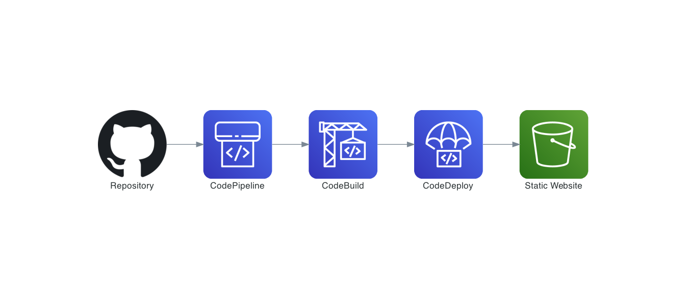

# Deploying a Static Website through CI/CD with CDKTF
The AWS development services allow you design a CI/CD process to deploy a static website to an S3 bucket. This repository contains the files developed in Typescript using CDKTF to get the source code, build it and deploy it automatically.

> Here you can find a static website built in React to use in this example [Link](https://github.com/jdiegobonp/react-staticwebsite).

## Pre-requisites
- Terraform
- CDK for Terraform
- AWS CLI
- AWS credentials

**Solution**




**Installation**
1. Clone this respository and go to the root folder.
2. Execute the following command to download all dependencies.
```sh
cdktf get
```
1. Open the main.ts file and fill out the following fields.
```javascript
    const bucketName = "<Put the name of the S3 bucket where the static website is"

    let gitHubParams = new Map<string, string>([
        ["personalToken", "<Generate and put the GitHub personal Token>"], 
        ["repository", "<Name of the GitHub repository where the static website is>"],
        ["branch", "<Branch name where you want to get the code>"],
        ["owner", "<Owner where the GitHub repository is>"]
    ]);
```
1. Execute the following command to deploy and deploy the services.
```sh
cdktf deploy --auto-approve
```
1. Once it's done, go to the AWS console and check the status of the Codepipeline and CodeBuild project.
2. After the pipeline is complete, go to the static website and validate the deployment.

**Clean Up**

To remove the resources deployed in the above steps execute the following steps:

1. Go to the CDKTF folder and execute the following commands:
```
cdktf destroy --auto-approve
```